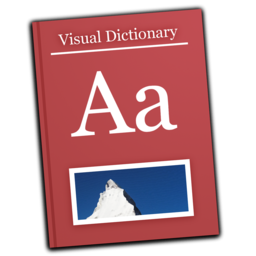

# Visual dictionary

for Mac


## Download



Download from [releases](https://github.com/knt5/visual-dictionary-mac/releases)

## Requirements

- Mac OS X 10.11 or later

## Recommended voice

- Samantha
  - How to install: [YouTube](https://www.youtube.com/watch?v=N6BOLPLsc6k)

## Development requirements

- Mac OS X ```^10.11```
- Xcode ```^7.3.1```
- Swift ```^2.2```

## Build

1. Open ```VisualDictionary/VisualDictionary.xcodeproj``` with Xcode
2. Build
