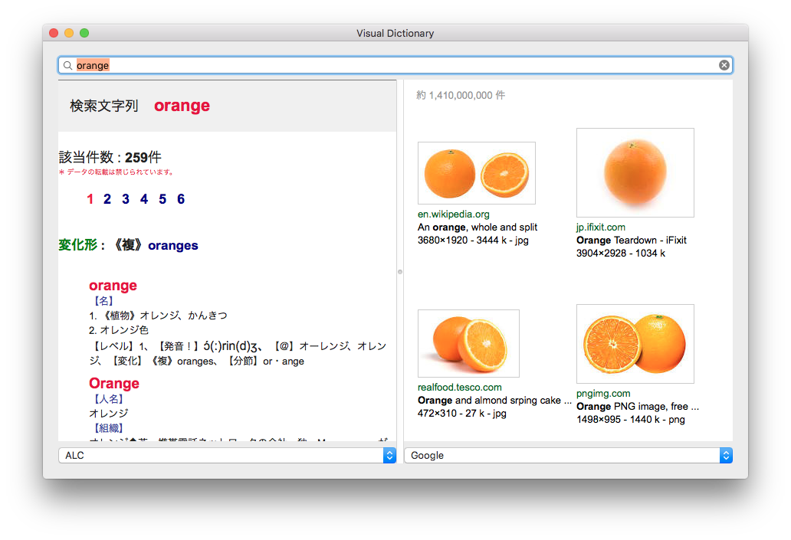

# Visual dictionary for Mac



## Requirements

- Mac OS X ^10.11

## Development requirements

- Mac OS X ^10.11
- Xcode ^7.3.1
- Swift ^2.2

## Build

1. Open ```VisualDictionary/VisualDictionary.xcodeproj``` with Xcode
2. Build
